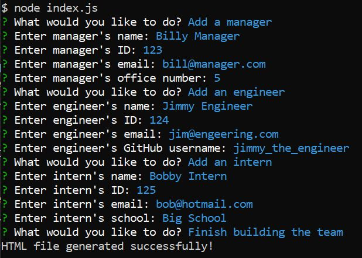
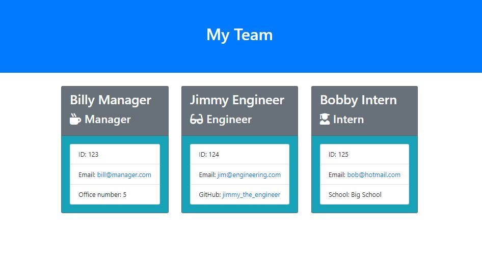

# Team-Profile-Generator
Application that will take in information about employees on a software engineering team, then generate an HTML webpage that displays summaries for each person

## Description
This project's aim is to create a command-line application that dynamically generates a HTML webpage from a user's input using the Inquirer package.

## Table of Contents
- [Installation](#installation)
- [Usage](#usage)
- [Tests](#tests)
- [Credits](#credits)
- [License](#license)
- [Badges](#badges)

## Installation
To install necessary dependencies, run the following command:
npm i

## Usage
After running node index.js, answer the question prompts from the command line:

This results in the following HTML page:

This example can be found in output/team.html within github.

## Tests
To run the various tests, run the following command:
npm test

## Credits

This README was created by following the Good-README-Guide on git.bootcampcontent:

https://git.bootcampcontent.com/uk-edx-16-week/UK-VIRT-FE-PT-10-2023-U-LOLC/-/blob/main/01-html-git-github-module/04-code-refactor-lesson/challenge/Good-README-Guide.md

## License
This application is covered under the MIT License.

## Badges

